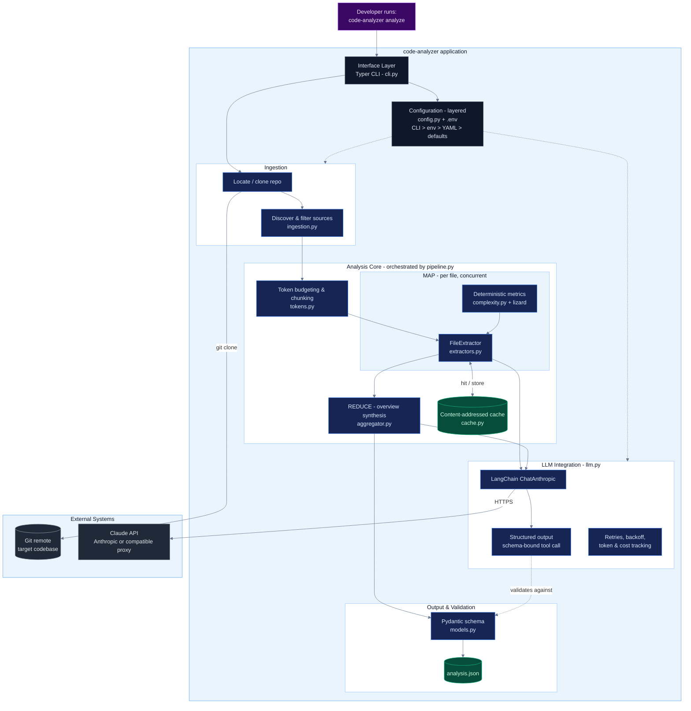
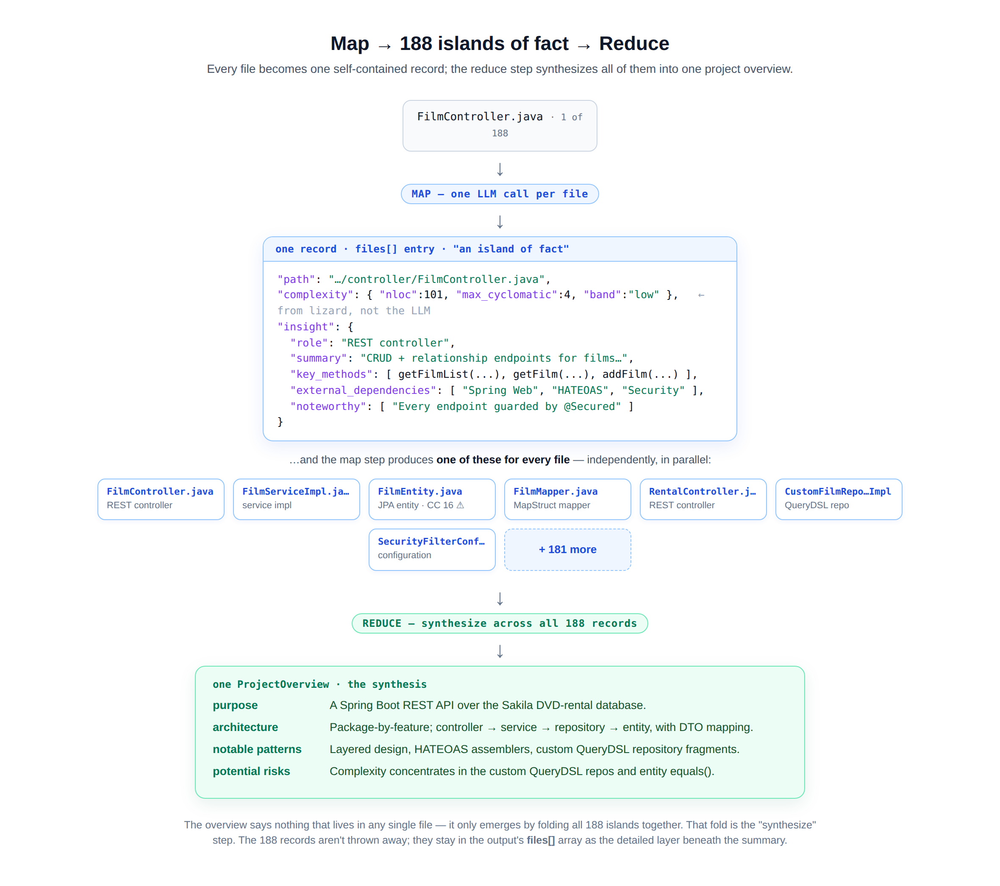
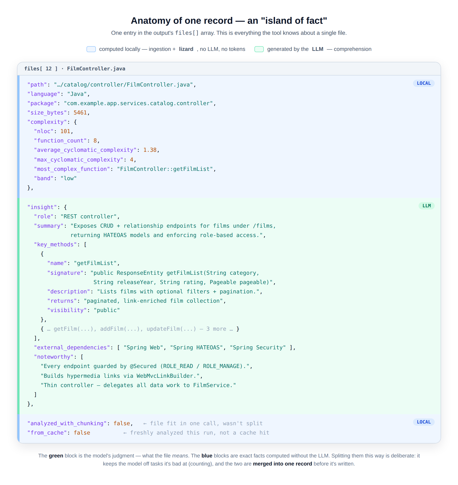
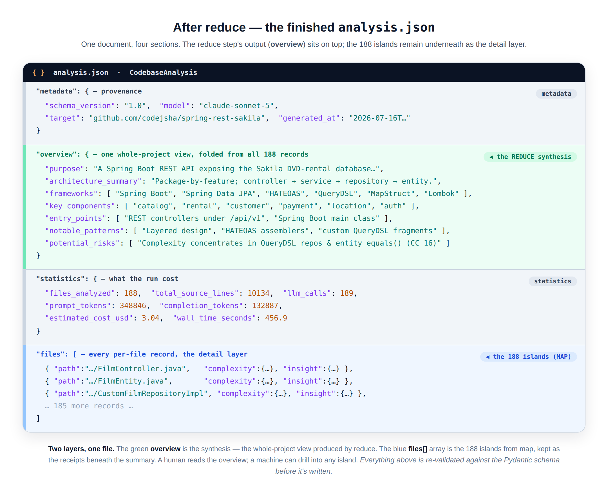

# Codebase Analysis using an LLM

[](https://github.com/AI-Trent-404/codebase-analyzer-llm/actions/workflows/ci.yml)

A program that reads an arbitrary codebase, feeds it to a Large Language Model in a
token-budget-aware way, and emits **structured, machine-readable JSON** describing the
project: a high-level overview, per-file method signatures and descriptions, complexity
metrics, and noteworthy design aspects.

Built with **LangChain + Anthropic Claude** and validated end-to-end against the
assignment's target repository, [`codejsha/spring-rest-sakila`](https://github.com/codejsha/spring-rest-sakila)
(188 Java files, ~10k LOC).

**Further reading:** [reference architecture](docs/ARCHITECTURE.md) ·
[architecture decisions (ADRs)](docs/adr/) · [security & data governance](SECURITY.md) ·
[scaling & productionization](docs/SCALING.md) · [evaluation strategy](docs/EVALUATION.md)

---

## 1. What it does (at a glance)

```
          ┌─────────────┐   ┌──────────────┐   ┌───────────────────────┐   ┌──────────────┐
  repo →  │  Ingestion  │ → │  Map step    │ → │  Reduce step          │ → │  Validated   │
          │  (filter &  │   │  per-file    │   │  synthesize project   │   │  JSON on disk│
          │   load)     │   │  extraction  │   │  overview             │   │              │
          └─────────────┘   └──────────────┘   └───────────────────────┘   └──────────────┘
                                  │  ▲                     │  ▲
                     LangChain + Claude          hierarchical summarize
                   (Pydantic structured out)      to respect token limits
```

- **Ingestion** discovers source files, filters out tests/build/vendor noise, and attaches
  language + package metadata — *before* any tokens are spent.
- **Map** analyzes each file with Claude, returning a schema-validated object (summary, role,
  key methods with signatures, dependencies, noteworthy items). Deterministic complexity
  metrics are computed separately by a static analyzer (no tokens).
- **Reduce** synthesizes a whole-project overview from the per-file digests, collapsing to
  per-package summaries first if the repo is too large to fit one prompt.
- The final object is **re-validated against the Pydantic schema** and written to JSON.

### Reference architecture



See **[docs/ARCHITECTURE.md](docs/ARCHITECTURE.md)** for the component-by-component breakdown,
runtime data flow, and cross-cutting concerns.

### How the data flows

The **map** step turns each source file into one self-contained record; the **reduce** step
synthesizes all of those records into a single project overview.



Anatomy of one record: the LLM writes the semantic `insight` (green); everything else — path,
package, and the `complexity` metrics — is computed locally by a static analyzer, no LLM (blue).



The finished `analysis.json` is two layers in one document — the synthesized `overview` on top,
the 188 per-file records underneath as the detail layer, plus provenance and run statistics.



---

## 2. Quick start

### Prerequisites
- Python 3.10+
- An Anthropic API key ([get one here](https://console.anthropic.com/settings/keys))
- `git` (only if you use `--repo-url` to clone)

### Install
```bash
cd codebase-analyzer
python -m venv .venv && source .venv/bin/activate    # recommended
pip install -r requirements.txt
pip install -e .        # registers the `code-analyzer` command (and enables `python -m code_analyzer`)
```

### Configure your key
```bash
cp .env.example .env
```
Then edit `.env`:
- `ANTHROPIC_API_KEY=...` — required.
- **Using the official Anthropic API?** That's all you need; the default model is a Claude Sonnet.
- **Using an OpenAI-compatible proxy / reseller endpoint?** Also set `ANTHROPIC_BASE_URL=` to the endpoint they gave you, and `ANALYZER_MODEL=` to a model id that endpoint accepts.

### Run it — three ways

```bash
# A) Clone the target repo and analyze in one step (real LLM):
code-analyzer analyze \
    --repo-url https://github.com/codejsha/spring-rest-sakila \
    --out out/analysis.json

# B) Analyze an already-cloned/local repo:
bash scripts/clone_target.sh                 # clones into ./target-repo
python -m code_analyzer analyze --repo target-repo --out out/analysis.json

# C) No API key handy? Exercise the whole pipeline with a heuristic stand-in:
python -m code_analyzer analyze --repo target-repo --dry-run
```

Or use the shortcuts in the **Makefile**: `make install`, `make dry-run`, `make analyze`, `make test`, `make schema`.

The output JSON is written to `out/analysis.json`. A ready-to-read example produced against
the target repo lives at [`examples/sample_analysis.json`](examples/sample_analysis.json), and
the machine-readable JSON Schema of the contract is at
[`examples/output.schema.json`](examples/output.schema.json).

---

## 3. Approach & methodology

### 3.1 Efficient codebase reading (staying within token limits)
The single most effective lever for both token cost and quality is **filtering before
prompting**. `ingestion.py` walks the tree and, in one pass, drops:
- non-source files (by extension allow-list),
- build/vendor/IDE directories (`build`, `.gradle`, `node_modules`, `target`, …),
- test sources by default (toggle with `--include-tests`),
- oversized/generated blobs (`max_file_bytes`).

For the target repo this narrows ~thousands of tree entries to **188 files that actually
carry meaning**.

### 3.2 Feeding code to the LLM within token limits
Two mechanisms guarantee we never exceed the context window:
- **Per-file chunking** (`tokens.py` + `extractors.py`): if a file exceeds
  `chunk_token_budget`, it is split on line boundaries, each chunk is analyzed, and the
  results are merged (methods de-duplicated by signature). This handles arbitrarily large
  files.
- **Hierarchical reduce** (`aggregator.py`): the project overview is built from compact
  one-line file digests. If even those exceed the input budget, the tool first summarizes
  **per package**, then combines the package summaries — a classic map-reduce that scales to
  repositories far larger than a single context window.

### 3.3 LLM integration with LangChain
`llm.py` wraps `ChatAnthropic` and uses LangChain's **`with_structured_output(schema)`**,
which binds a Pydantic model to the model as a tool call. Claude is therefore *forced* to
return an object that matches the schema — there is **no brittle text/regex parsing**, and
the output is consistent and machine-readable by construction.

### 3.4 Deterministic vs. LLM work (a deliberate separation)
Line counts and cyclomatic complexity are **exact, reproducible facts**. Asking an LLM to
produce them wastes tokens and invites hallucination. So `complexity.py` computes them with
[`lizard`](https://github.com/terryyin/lizard) (language-agnostic: Java, Kotlin, Python, Go,
C-family, …) and the LLM is reserved for genuine *comprehension* — intent, roles, and
patterns. This is why the sample flags `FilmEntity.equals` (cyclomatic complexity 16) as a
hotspot: that number is measured, not guessed.

### 3.5 Structured, consistent output
`models.py` is the single source of truth for the output contract. The same schema is used
to (1) constrain the LLM, (2) re-validate results before writing, and (3) document the JSON
for downstream consumers. `python -m code_analyzer schema` emits the JSON Schema.

---

## 4. Best practices applied

| Concern | How it's handled |
|---|---|
| **Token budgeting** | Aggressive pre-filtering, per-file chunking, hierarchical reduce. |
| **Reliable structured output** | Pydantic + LangChain `with_structured_output`; re-validation before write. |
| **Cost & observability** | Thread-safe token/cost tracker; run summary table; per-run statistics in the JSON. |
| **Resilience** | Exponential-backoff retries (`tenacity`); one bad file never aborts the run. |
| **Performance** | Concurrent per-file analysis via a thread pool (I/O-bound calls). |
| **Idempotency / cost control** | Content-addressed cache keyed on `content + model + prompt version`. |
| **Determinism** | `temperature=0`, sorted file ordering, stable output. |
| **Security** | Secrets are redacted from code before egress to the model (`redaction.py`); see [SECURITY.md](SECURITY.md). |
| **Configuration** | Layered config: CLI > env (`ANALYZER_*`) > YAML > defaults; secrets via `.env`. |
| **Testability** | Deterministic components unit-tested; `--dry-run` runs the pipeline offline. |
| **Separation of concerns** | Ingestion / chunking / LLM / extraction / aggregation / CLI are independent modules. |

---

## 5. Project structure

```
codebase-analyzer/
├── README.md                     ← you are here
├── requirements.txt / pyproject.toml
├── Makefile                      ← install / dry-run / analyze / test / schema
├── .env.example                  ← API key template
├── config.example.yaml           ← optional config file
├── scripts/clone_target.sh       ← clone the target repo
├── examples/
│   ├── sample_analysis.json      ← example output (target repo, overview + 10-file excerpt)
│   └── output.schema.json        ← JSON Schema of the output contract
├── src/code_analyzer/
│   ├── models.py                 ← Pydantic schemas = the output contract
│   ├── config.py                 ← layered settings + pricing table
│   ├── ingestion.py              ← discover/filter/load source files
│   ├── tokens.py                 ← token counting & budget-aware splitting
│   ├── complexity.py             ← deterministic metrics via lizard
│   ├── prompts.py                ← versioned prompt templates
│   ├── llm.py                    ← LangChain + Claude, structured output, retries, usage
│   ├── mock.py                   ← offline heuristic stand-in for --dry-run
│   ├── cache.py                  ← content-addressed insight cache
│   ├── extractors.py             ← MAP: per-file analysis (+ chunk merge)
│   ├── aggregator.py             ← REDUCE: hierarchical project overview
│   ├── pipeline.py               ← orchestration + concurrency + stats
│   └── cli.py                    ← Typer CLI (analyze / schema)
└── tests/                        ← pytest suite for the deterministic core
```

---

## 6. Output format

Top-level shape (see `examples/sample_analysis.json` for a full instance):

```jsonc
{
  "metadata":   { "schema_version", "generated_at", "target", "model", "tool_version" },
  "overview":   { "purpose", "architecture_summary", "frameworks", "key_components",
                  "entry_points", "notable_patterns", "potential_risks", ... },
  "statistics": { "files_analyzed", "total_source_lines", "llm_calls",
                  "prompt_tokens", "completion_tokens", "estimated_cost_usd", ... },
  "files": [
    {
      "path", "language", "package", "size_bytes",
      "complexity": { "nloc", "function_count",
                      "average_cyclomatic_complexity", "max_cyclomatic_complexity",
                      "most_complex_function", "band" },
      "insight":    { "summary", "role",
                      "key_methods": [ { "name", "signature", "description",
                                         "parameters", "returns", "visibility" } ],
                      "external_dependencies", "noteworthy" }
    }
  ]
}
```

> Note: `examples/sample_analysis.json` shows the **complete overview and run statistics**
> from a full 188-file analysis, with the `files` array trimmed to **10 representative
> entries** for readability. A live run regenerates all 188.

---

## 7. Configuration reference

Any of these can be set via CLI flag, `ANALYZER_*` env var, or a `--config` YAML file
(precedence: CLI > env > YAML > default).

| Key | Default | Purpose |
|---|---|---|
| `model` | `claude-sonnet-4-20250514` | Claude model for comprehension. |
| `temperature` | `0.0` | Deterministic extraction. |
| `max_input_tokens` | `150000` | Safety budget below the context window. |
| `chunk_token_budget` | `12000` | Per-file size before splitting. |
| `max_concurrency` | `6` | Parallel LLM calls. |
| `max_retries` | `4` | Backoff attempts on transient errors. |
| `include_tests` | `false` | Analyze test sources too. |
| `max_files` | `null` | Cap files for a cheap run. |
| `cache_enabled` | `true` | Content-addressed caching. |
| `redact_secrets` | `true` | Scrub credentials from code before sending to the LLM. |

---

## 8. Testing

```bash
make test        # or: pytest
```

The suite (14 tests) covers the deterministic core — token budgeting/splitting, ingestion
filters and package derivation, complexity banding, schema round-tripping, and cache
content-addressing. LLM calls are intentionally *not* asserted for exact wording (they are
non-deterministic by nature); the `--dry-run` path exercises the full pipeline offline.

---

## 9. Assumptions & limitations

- **Local checkout.** The analyzer runs against a local directory. `--repo-url` clones for
  you; otherwise point `--repo` at a checkout.
- **Token counting is an estimate.** Anthropic's tokenizer isn't public, so budgets use
  `tiktoken`'s `cl100k_base` as a close (slightly conservative) proxy, with a char-based
  fallback if `tiktoken` is absent. Real usage/cost in the summary come from the API's
  reported token counts.
- **Cost figures are estimates** from a static price table (`config.py`); update it if
  Anthropic pricing changes.
- **Comprehension quality tracks the model.** `--dry-run` output is heuristic and only for
  plumbing/demo — it is not a substitute for a real run.
- **Language coverage.** LLM analysis is language-agnostic; complexity metrics cover the
  languages `lizard` supports. Semantic linking *across* files (call graphs) is out of scope
  by design — the tool favors reliable per-file facts plus a synthesized overview.

---

## 10. Presenting this solution — step-by-step

A tight script for the screen-share walkthrough.

**Before the call (2 min):**
1. `pip install -r requirements.txt` and put your key in `.env`.
2. Pre-clone once: `bash scripts/clone_target.sh`.
3. Open `examples/sample_analysis.json` in an editor so you can show output instantly even
   if the network is slow.

**Suggested 8–10 minute flow:**

1. **Frame the problem (30s).** "The goal is to turn a codebase into structured knowledge an
   LLM can produce reliably and a machine can consume. I chose LangChain + Claude, and I
   treated *token budgeting* and *structured output* as the two hard problems."

2. **Show the output first (1 min).** Open `examples/sample_analysis.json`. Point at the
   `overview` (purpose, architecture, risks), then one `files[]` entry — highlight that every
   method has an exact `signature` and that `complexity` is measured, not guessed. This proves
   the deliverable before touching code.

3. **Show the schema is the contract (1 min).** Open `models.py`. Explain that the same
   Pydantic schema constrains Claude (`with_structured_output`), re-validates the result, and
   documents the JSON — so output is consistent and machine-readable by construction. Run
   `python -m code_analyzer schema` to show the emitted JSON Schema.

4. **Walk the pipeline (2 min).** `ingestion.py` → filter noise before spending tokens;
   `extractors.py` → the map step with per-file chunking; `aggregator.py` → the reduce step
   with hierarchical per-package summarization. This is the token-limit story end-to-end.

5. **Call out the Principal-level decisions (1 min):**
   - Deterministic metrics (`lizard`) vs. LLM comprehension — right tool for each job.
   - Concurrency + retries + content-addressed caching for cost and resilience.
   - `--dry-run` so the whole system is testable/demoable without a key.

6. **Run it live (2 min).**
   - Cheap + fast: `python -m code_analyzer analyze --repo target-repo --dry-run` (finishes in
     seconds, shows the progress bar + summary table).
   - If time/budget allow: a real, capped run:
     `python -m code_analyzer analyze --repo target-repo --max-files 12 --out out/live.json`
     then open `out/live.json`.

7. **Run the tests (30s).** `make test` → 14 passing, to show the deterministic core is
   covered.

8. **Close with trade-offs (30s).** Point them to §9 (limitations) — showing you know the
   edges of your own solution reads as senior.

**Likely questions & crisp answers:**
- *"How do you handle a file bigger than the context window?"* → line-boundary chunking +
  method-level merge (`extractors.py`).
- *"A repo with 50k files?"* → pre-filtering, then hierarchical reduce; concurrency and the
  cache keep cost/latency in check; `--max-files` for sampling.
- *"Why LangChain?"* → `with_structured_output` gives guaranteed-valid typed output and keeps
  the provider swappable; the schema, not the prompt, defines the format.
- *"How do you keep output consistent run-to-run?"* → `temperature=0`, sorted ordering,
  schema validation, and caching.
