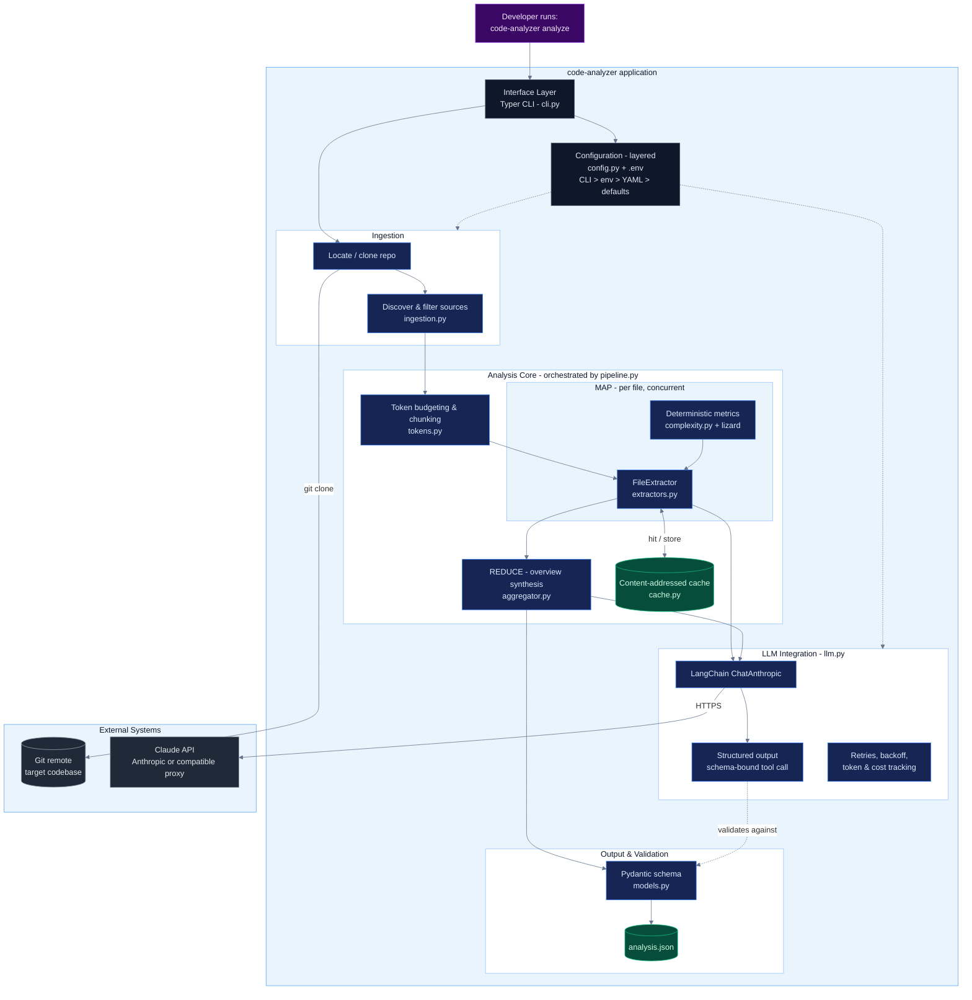

# Reference Architecture

This document describes the architecture of the codebase analyzer: its layers,
components, runtime data flow, and the cross-cutting concerns that make it
production-grade. It complements the [README](../README.md), which covers usage.

## System diagram

## Components and responsibilities

| Layer | Component | Responsibility |
|---|---|---|
| Interface | `cli.py` (Typer) | Parse commands/flags, resolve the target repo, render the run summary. |
| Configuration | `config.py` + `.env` | Single, typed, layered source of truth (CLI > env > YAML > defaults); keeps secrets out of code. |
| Ingestion | `ingestion.py` | Walk the repo; filter out tests, build output, vendor and generated files; attach language/package metadata — **before** any tokens are spent. |
| Core / budgeting | `tokens.py` | Count tokens and split oversized files on line boundaries so every unit fits the context window. |
| Core / MAP | `extractors.py` | Per-file analysis: call the LLM for schema-bound insight, merge chunk results, attach metrics. Runs concurrently. |
| Core / metrics | `complexity.py` (lizard) | Deterministic line counts and cyclomatic complexity — computed without the LLM. |
| Core / REDUCE | `aggregator.py` | Synthesize a project overview from per-file digests; summarize per-package first if the set is too large (hierarchical reduce). |
| Core / cache | `cache.py` | Content-addressed cache keyed on `content + model + prompt version`; skips unchanged files on re-runs. |
| LLM integration | `llm.py` | Wrap LangChain `ChatAnthropic`; enforce structured output; retries with backoff; thread-safe token/cost tracking. Provider-agnostic via optional base URL. |
| Output | `models.py` | Pydantic schema that constrains the LLM, validates the assembled result, and documents the JSON contract. |
| Orchestration | `pipeline.py` | Wire the stages together, manage the thread pool, and assemble statistics. |

## Runtime data flow

1. The CLI loads layered configuration (`.env` + flags) and resolves the target codebase, cloning it if a URL was given.
2. Ingestion discovers and filters source files, so only meaningful code proceeds.
3. Each file is token-budgeted and, if necessary, chunked to fit the model's context window.
4. **MAP** — every file is analyzed concurrently. `lizard` supplies exact complexity metrics; the LLM supplies comprehension via a schema-bound (structured-output) call. Results are cached by content hash.
5. **REDUCE** — per-file digests are synthesized into a project overview, collapsing to per-package summaries first when the set exceeds the input budget.
6. The assembled object is re-validated against the Pydantic schema and written to `analysis.json`, alongside run statistics (tokens, estimated cost, timings).

## Cross-cutting concerns

- **Token & cost control** — filter before prompting, compute deterministic facts without the LLM, cache unchanged files, and report usage per run.
- **Resilience** — exponential-backoff retries on transient/malformed responses; a single failing file is skipped, never fatal to the run.
- **Concurrency** — per-file LLM calls run in a thread pool; the usage tracker and cache are thread-safe.
- **Reproducibility** — `temperature = 0`, deterministic file ordering, and schema validation yield stable output.
- **Provider portability** — an optional base URL routes the same code through the official Anthropic API or any compatible proxy.

## Key design decisions

- **Map-reduce over the file set** answers the core constraint: the codebase is larger than the model's context window.
- **Schema-bound structured output** makes the result machine-readable by construction — no text parsing.
- **Deterministic tooling for deterministic facts** (complexity) reserves the LLM for judgment, cutting cost and hallucination risk.
- **One schema, three jobs** (constrain, validate, document) keeps the output contract consistent.

## Technology stack

Python 3.10+ · LangChain + `langchain-anthropic` · Anthropic Claude (or compatible endpoint) · Pydantic v2 / pydantic-settings · Typer + Rich · Tenacity · lizard · tiktoken.
